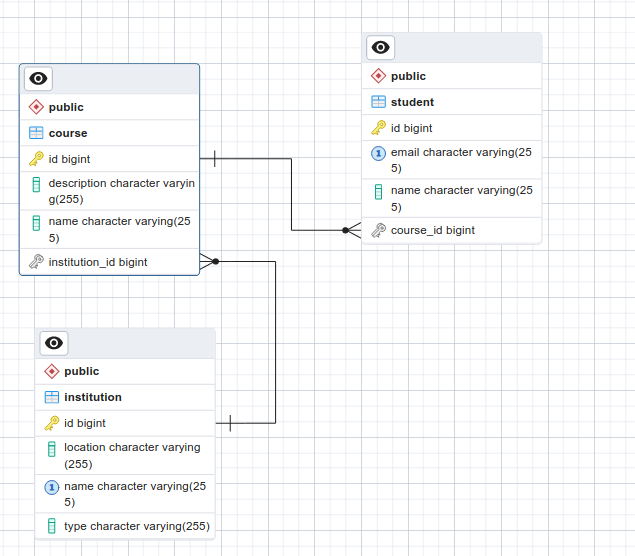

# Uni API

An API for managing institutions, courses and students

## Getting Started

### Prerequisites

Ensure you have the following installed:

- [Java](https://www.oracle.com/java/technologies/javase/jdk17-archive-downloads.html) (version 17)
- PostgreSQL Database (and optionally, PgAdmin)
- Docker (if you'd like to run the application using docker)

### Running the application
The application can be run in two ways:

#### A. Locally
If you're using an IDE like IntelliJ, you can run the app using the 'Play' button

Otherwise, you can run the app on your terminal:

1. Navigate to your project directory

    ```bash
    cd /path/to/your/project
   ```
2. Run:

    ```bash
    gradlew bootRun
   ```

#### B. Using docker

1. First build your application to produce a .jar file

    ```bash
    gradlew bootJar
   ```
   
2. You will find the .jar file in the build/libs directory

    ```bash
    /your-project
    |---build
        |---libs
            |---your-application.jar
    |---build.gradle
   ```
3. Build the image

    ```bash
    docker build -t <your-image-name>:<tag> .
   ```
4. Run the container based on the image, adding environment variables. 
   Note that docker adds a tag (latest) at the end if one is not defined

    ```bash
    docker run -p 8080:8080 \
    -e DATABASE_URL=<your-db-url> \
    -e DATABASE_USERNAME=<your-db-username> \
    -e DATABASE_PASSWORD=<your-db-password> \
    <your-image-name>:<tag>
   ```

**Note**: If you're on Linux/MacOS, use ```./gradlew``` instead of ```gradlew```

## Database Schema

The database schema used: 




## Postman collection

The following resource contains a published collection of the API Endpoints for Uni API:

[Uni API Postman Collection](https://documenter.getpostman.com/view/21484054/2s9Ye8gahP)